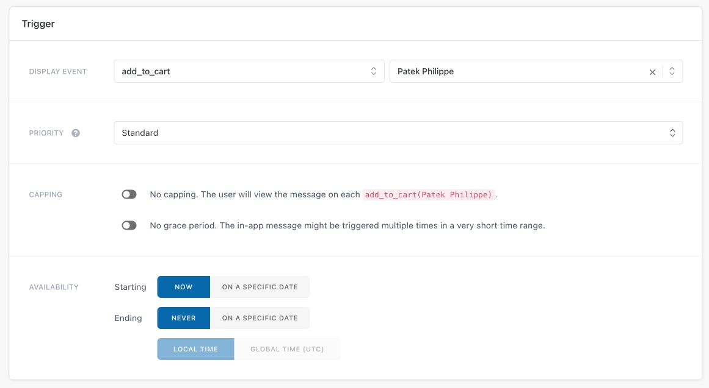

# Batch store
This sample is a full fledged example meant to show both basic and advanced integrations of the Batch SDK with a real-world use case.  

# How run it
* Clone this repository
* Follow this instructions about prerequisites [https://doc.batch.com/ios/prerequisites](https://doc.batch.com/ios/prerequisites). You will need to associate the project to a Firebase Project to continue.
* Batch SDK is already installed, you have to setup Batch with your API KEY in `AppDelegate.swift`: search for `let BatchAPIKey`
* Run your app. You should see the following log :

```
[Batch] Installation ID: <your installation ID>
```
More informations : [https://doc.batch.com/ios/sdk-integration/initial-setup](https://doc.batch.com/ios/sdk-integration/initial-setup)

# In-app Messaging

You can setup your first In-app campaign.

### How sample work
In-app campaigns will appear on your users’ screen according to a specific trigger.
For example, you can choose to display an In-app promoting a discount when a user add one article to cart.

Sample app contains 3 triggers 
```swift
// Track when the user selects an article
class func trackArticleVisit(_ article: Article) {
    BatchProfile.trackEvent(name: "ARTICLE_VIEW", attributes: BatchEventAttributes { attrs in
        attrs.put(article.name, forKey: "$label")
        attrs.put(article.name, forKey: "article")
    })
}

// Track when the user add article to cart
class func trackAddArticleToCart(_ article: Article) {
    BatchProfile.trackEvent(name: "ADD_TO_CART", attributes: BatchEventAttributes { attrs in
        attrs.put(article.name, forKey: "$label")
        attrs.put(article.name, forKey: "article")
    })
}

// Track when the user proceed to checkout
class func trackCheckout(_ amount: Double) {
    BatchProfile.trackEvent(name: "CHECKOUT")
}
```
This triggers can be use in the Batch dashboard with labels. 
More details here : https://doc.batch.com/dashboard/in-app-messaging/campaign-edition.html#_trigger-condition

**Example :**
- Create campaign
- Set trigger **display event** : `add_to_cart`
- Set **label** : `Patek Philippe` (If you don’t select any labels, Batch will trigger the message on every trigger of the selected event)

- Setup message edition on the interface

In app, if you select Patek Philippe in your cart, you will see In App messaging.


## Resources
* [Full Batch documentation](https://doc.batch.com)
* [support@batch.com](support@batch.com)